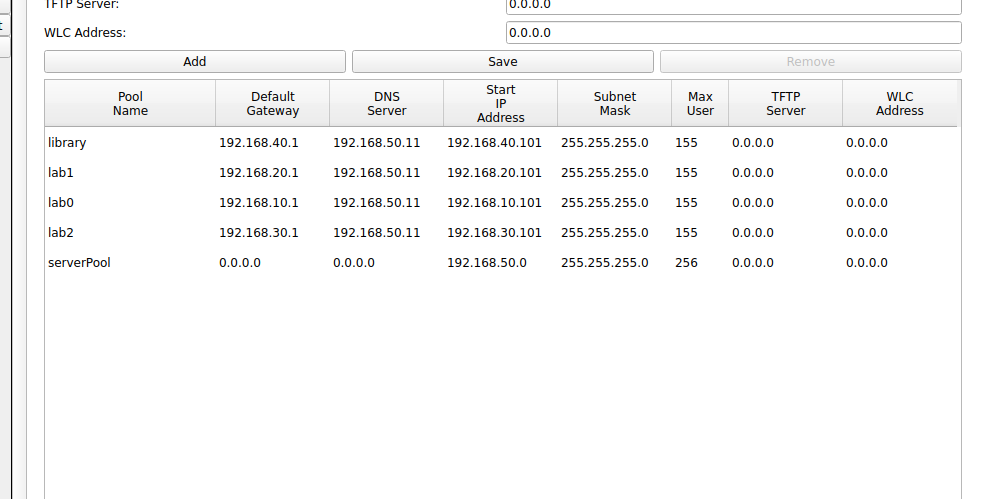

= Network Design for a Research Institute
Myint Myat Aung <myintmyataung@uit.edu.mm>
:source-highlighter: rouge
:rouge-style: github
:doctype: book
:toc:

== Part A: Designing a network

=== Scenario

Yangon Computer Research Institute (YCRI) is a hypothetical institute specializing in computer science and IT research.
Research undertaken range from the development of specialized operating systems to software complexity analysis to training Large Language Models.
Members of the institute are renowned professors and students from both Myanmar and foreign universities.
It is YCRI's cutting-edge computing-related facilities that attract such academics to pursue their research at the institute.

.YCRI's research labs would be more reminiscent of a coworking space than a traditional lab.
image::coworkingspace.jpg[width=400]

YCRI offers spacious research labs for teams of researchers to carry out their work in.
Each lab contains multiple computers and laptops connected to the institute's network through which YCRI's supercomputer can be accessed.
The supercomputer can be utilized to perform computationally demanding calculations or run time-consuming programs.
Furthermore, network storage of research data is available.

.Victoria University Library. YCRI's library would look like this.
image::library.jpg[width=400]

YCRI also features a free-for-all library which acts as a collaborative area for researchers to come together and exchange ideas.
In addition to a wide variety of physical books, an extensive ebook catalogue is accessible via Wi-Fi or one of many computer terminals stationed in the area.

=== Network requirements

From the description above, we can infer that YCRI's network has the following requirements:

* High-performance: Researchers will be using the network extensively to do calculations and exchange data and this requires high-bandwidth communication.
* Reliability: The network must have a high uptime to enable researchers to reliably access their compute devices.
* Security: While the internal network requires external internet access, the internet must not be able to access private data and services inside the YCRI network.
* Scalability: More hosts are sure to be configured considering YCRI's growth. The network must be scalable enough to handle both these hosts and the network required to accomodate their activities.

From these requirements, we have determined a topology most fit for YCRI.

=== Network topology

The network architecture follows Cisco's recommendation of a traditional 3-tier hierarchical network architecture.
It is a design framework used to create scalable, modular, and efficient network infrastructures.

The hierarchy consists of these layers:

* Access layer: The bottom layer of the hierarchy, closest to end-user devices.
Responsible for connecting end-user devices such as computers, phones, and printers to the network.
* Distribution layer: The middle layer that acts as an aggregation point for traffic from the access layer and provides routing, filtering, and policy-based connectivity.
* Core layer: The topmost layer responsible for high-speed, high-capacity forwarding of data.

This allows for the following benefits in our network:

* Scalability: Allows for the easy addition of access switches and devices in the access layer without impacting core and distribution layers.
* Modularity: Each layer performs specific functions, making it easier to upgrade or replace components without affecting the entire network.
* Hierarchical Design: Provides a clear separation of duties between layers, improving network organization and troubleshooting capabilities.
* Redundancy: The architecture supports redundancy and fault tolerance, ensuring network reliability.
* Security: Security policies can be implemented at multiple levels, including the access layer, to control user access and network traffic.
* Optimized Traffic Flow: Optimizes the flow of network traffic, reducing unnecessary traffic between layers.

Cisco's three-tier hierarchical network architecture is widely used in enterprise networks and data centers to create robust and scalable network infrastructures capable of meeting the demands of modern businesses and applications.

In addition, our network is has a fully-meshed star topology, with redundant links and aggregated ports. By meshing at least two of the same device type, we can ensure operation when one device goes down.

.YCRI's network

YCRI has the following buildings and departments:

* Building 0
    * Research Lab 0
    * Research Lab 1
    * Research Lab 2
* Building 1
    * Library
    * Server Room

These departments are reflected in the network topology by VLANs.
Both buildings have their own distribution switches.
The distibution layer then connect to the core layer which is located in a separate building.
This core layer provides an internet edge to ISP routers, protected by firewalls.

==== Labs

Each lab is in its own vlan.
Lab members will use the server and supercomputer to store their research data and run calculations.

==== Library

The library is a public area with an access point.
Many guests and outsiders will access the network through the library and ACLs are used to prevent access to the labs' computers and the supercomputer.

==== Server Room

The main server takes care of:

* DHCP
* DNS
* FTP

The supercomputer is used to run virtual machines and programs that carry out computations.

== Part B: Technologies used designing a network

=== VLANs and Inter-vlan routing

A VLAN (Virtual Local Area Network) is a technology used in computer networking to logically segment a physical network into multiple isolated virtual networks.
Each VLAN functions as if it were a separate physical network, even though devices in different VLANs may share the same physical network infrastructure.

Using VLANs for each department/physical area in our network allows isolation of Layer 2 traffic which offers the following advantages:

* Reducing network congestion by segmenting broadcast domains
* Enhancing security by separating sensitive data and applications from less secure areas of the network.
* Simplifying network management by letting us treat a department as a VLAN. This capability is used to easily set Access Control Lists (ACLs) later on.
* Simplifying physical hardware management by delegating physical organization of cables and switches to software. The three labs in the figure below can share a room of switches without caring about which switch belongs to which lab.

Inter-vlan routing allows devices from different VLANs to communicate with each other.
This is done by using scalable Multilayer Switches.

.Logical networks care not of their physical connections.

=== Variable Length Subnet Masks (VLSM)

VLSM is a technique used in computer networking to optimize the allocation of IP addresses within a network.
It allows for more efficient utilization of IP address space by allowing subnets of different sizes (i.e., different subnet masks) to be used within the same network.

Our network uses VLSM in all of its Layer 3 connections.
The number of current and future hosts are considered before determining a subnet mask to ensure that as little network space is wasted as possible.

.VLSM is used in the network.

* All point-to-point (router to router) connections use a /30 mask because only 2 hosts are on each network. +
This allows us to have a large number of point-to-point networks.
* VLANs for departments have a /24 mask that allows for 254 hosts (+ 2 broadcast and network IP). +
We have taken into account the growth of the network in the future and estimated that, at the maximum, 254 hosts will be connected to a VLAN at once.

=== DHCP and Static IPs

Dynamic Host Configuration Protocol (DHCP) is a network protocol used for automatically assigning IP addresses and other network configuration parameters to devices on a network.

All end devices that do not need a static IP are provided an IP by the main YCRI server.
There is a DHCP pool for each VLAN.
In each VLAN subnet (/24), only about half of the addresses (starting from .101) are in the DHCP range.
The addresses below .101 are reserved for static IPs that can be manually assigned to hosts, allowing for future extension of the network.

.DHCP pools on the main server

By having a centralized DHCP server, we obtain the following benefits:

* Scalablilty: DHCP can accommodate a growing number of devices without manual IP address management.
* Ease of Deployment: DHCP is easy to setup. Devices can be added to the network without manual configuration, reducing the risk of errors.
* Centralized Management: Being able to manage IP addresses from one place means effective network administration and reduced risk of conflicts.

=== Domain Name System (DNS)

The Domain Name System (DNS) is a fundamental protocol used to translate human-friendly domain names into IP addresses that computers can use to identify each other.

YCRI uses DNS hostnames internally to refer to key devices with static IPs.
The main server acts as the central DNS server for the whole network.
Current DNS entries are show below:

By having DNS hostnames for internal devices such as IP printers and servers:

* It is easier to remember for users.
* Programs using DNS names need not be reconfigured should the actual static IPs change. The DNS entry can simply be updated.

In addition, YCRI's network allow internet DNS hostnames to be partially resolved as well by redirecting .com internet queries to Google's DNS servers 8.8.8.8.

=== Firewalls

A firewalls are network security devices or software that serves as a barrier between a trusted internal network and untrusted external networks, such as the internet.
Its primary purpose is to monitor, filter, and control incoming and outgoing network traffic based on a set of predefined security rules and policies.

Two redundant firewalls are configured to access the external network along with extended Access Control Lists to secure the internal network from the internet.

=== Access Control Lists (ACLs)

Access Control Lists (ACLs) are used to control and filter traffic based on specific rules and policies. ACLs are commonly implemented on routers, switches, and firewalls to permit or deny network traffic based on criteria such as source and destination IP addresses, port numbers, and protocols.

ACLs are used to filter network traffic, allowing or denying packets to pass through a network device based on predefined rules.
These rules are applied to incoming or outgoing traffic on specific interfaces or network segments.

=== Port aggregation: LAGP

Port aggregation, also known as Link Aggregation or EtherChannel (in Cisco terminology), is a networking technique that allows multiple physical network links to be combined into a single logical link. This logical link appears to network devices as a single, higher-bandwidth connection, providing increased throughput, redundancy, and load balancing.

YCRI's network core layer uses port aggregation between core switches to allow fast switching and data transfer.
Data from different buildings can travel through the core at a high speed.
The redundancy also improves reliability.

=== Dynamic routing: OSPF and static routes

OSPF, which stands for Open Shortest Path First, is a dynamic routing protocol used in computer networks to determine the best path for routing IP packets.
It is one of the most widely used interior gateway protocols (IGP) within enterprise networks and the internet. 

OSPF is set up on all Layer 3 devices to allow automatic discovery of neighbors and routing.
Using OSPF provides us with these benefits:

* Rapid Convergence: OSPF is known for its fast convergence. It quickly adapts to network changes, such as link failures or additions, and updates routing tables. This reduces downtime and ensures efficient routing even in dynamic environments.
* Scalability: OSPF's hierarchical structure with multiple areas and the ability to summarize routing information between areas makes it highly scalable. Large and complex networks can be efficiently managed without overwhelming routers with excessive routing updates.
* High Availability: OSPF supports redundancy, ensuring network uptime even in the presence of equipment failures.
* Simplified management: Network administrators no longer need to manually configure every route in the network.

Static routes are configured for any route going out to the internet that OSPF does not know about.

=== Port security

Port security is a network security feature implemented on Ethernet switches to control and restrict access to a network by managing the devices connected to individual switch ports. It helps protect against unauthorized access and potential security threats by allowing network administrators to define and enforce policies for device connectivity.

Port security is activated in every switch port in the network.
A port security-level is set to "protect", that is, packets from unknown devices connected to a particular port are dropped.
This is a non intrusive way of denying unsafe computers access to the network.

Furthermore, unused switchport are shutdown to prevent the attack surface of the network.

=== Hot Standby Router Protocol (HSRP)

As reliability is one of the key goals of the YCRI network, redundancy is of utmost importance.
Should one default gateway go down, a backup must be there to handle all routes without downtime.
This is done using HSRP.

HSRP, or Hot Standby Router Protocol, is a network protocol developed by Cisco to provide high availability and fault tolerance in IP networks. HSRP allows multiple routers to work together as a virtual router, ensuring continuous network connectivity in the event of a router failure.

In YCRI's network, the distribution layer MLSes use HSRP to act as a single gateway.

=== FTP and HTTP

FTP, or File Transfer Protocol, is a standard network protocol used for transferring files between a client and a server on a computer network.
HTTP, or Hypertext Transfer Protocol, is the foundational protocol of the World Wide Web. It facilitates the exchange of data between web clients (like web browsers) and web servers, enabling the retrieval and display of web content.

YCRI's main server hosts FTP and works as a network storage for researchers to store and share their findings with others.
This is provided along with an HTTP frontend to easily sort through and manage knowledge.

=== WLAN

YCRI's network include wireless access points (APs) which create WLANS.

WLAN is used to easily connect phones and laptops to the institute's network.

== Part C: Investigation of Network Traffic

=== VLAN and HSRP configuration

VLANs are named and configured in Multilayer Switches.
HSRP combines the 2 distribution-layer MLSes into a virtual router with High Availability.

.MLS area0-dist0 (for 3 labs)

.MLS area1-dist1 (for Library and Server room)

=== OSPF and static routes configuration

OSPF configured on all Layer 3 devices help routing devices find each other.
Static routes are for internet-bound packets.

.MLS area0-dist0 (for 3 labs)

.MLS area1-dist1 (for Library and Server room)
image::ospfconfig2.png[]

.A successful tracert from lab3 to server

=== DHCP configuration

DHCP is configured on the central server, providing aliases to static IP devices.

=== Firewall ACL configuration

Firewall is configured to only allow HTTP connections from trusted IP addresses, such as Google, for inbound connections.

The DNS server forwards any internet address (like google.com) to Google DNS servers.

=== Redundancy check

YCRI's network boasts adequate redundancy. Every aspect of the network is designed to provide redundancy. There are multiple routes and devices that traffic can go through.

To test this capability, a worst-case scenario may look like this:

.Worst case
image::extremecase.png[]

Even in this case, traffic still routes successfully from a local PC to Google's servers and back.

.Tracert from lab2 pc to Google

<<<

== Conclusion

YCRI's network utilizes many modern networking technologies that ensures its scalability, reliability and performance, which is required due to YCRI's demanding network requirements.
We have observed from designing the network that choosing network technologies is rarely a this-or-that situation.
Rather, it is through combining all these technologies that one covers another's weaknesses and improve the capabilities of the network as a whole.
The technologies that were used such as OSPF, VLANs, ACLs and HSRP all contribute to our goal of having a highly-performant, reliable and secure network.
In addition, the 3-tier architecture further boosts scalability by allowing different parts of the network to perform specific functions (like distribution and core intercommunication).
Being future-proof is an important concern as well as the network will continue to grow.
Networking hardware like cables, once laid out, are difficult to change or reconfigure, so it is vital that proper analysis is done to plan out in advance.

Improvements that can be made include:

* Adding OSPF authentication to protect route information from the external internet.
* Setting up SSH on network devices to allow secure remote configuration.
* Adding Network Address Translation (NAT) for better security from the internet.
* Configuring a Demilitarized Zone (DMZ) for managing direct access to internal resources and improving security.
